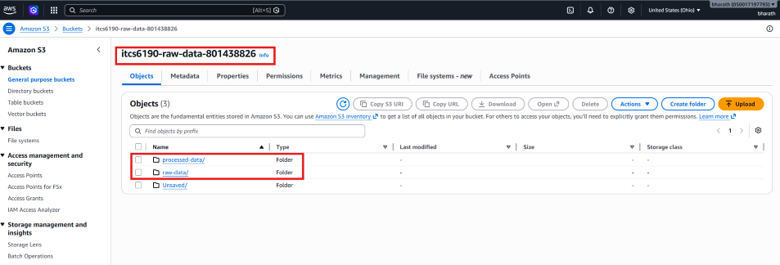
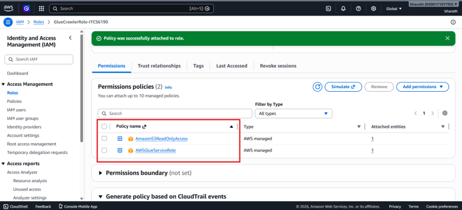
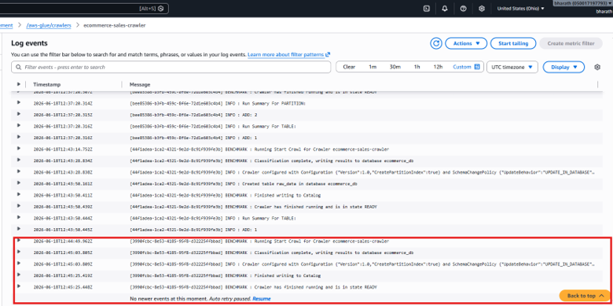

> **Note:** Please refer to the initial project requirements in the [itcs6190_aws_core_services.pdf](https://github.com/ITCS6190-Summer2026/Hands-on-AWS-Core-Services/blob/main/itcs6190_aws_core_services.pdf) file before proceeding with the configurations below.

## AWS Core Services Assignment Guide

### 1. S3 Bucket Setup & Structure
* **Global Uniqueness:** S3 bucket names must be globally unique across all AWS accounts. Append a unique identifier, such as your student ID or initials (e.g., `itcs6190-raw-data-[yourinitials]`).
* **Recommended Structure:** Create either two separate buckets or one main bucket with two folders:
  * `raw-data/` -> Upload your downloaded Kaggle CSV here.
  * `processed-data/` -> Designate this for Athena query results.

### 2. IAM Role Configuration
To give your Glue Crawler permission to access your data, create an IAM Role with the following parameters:
* **Trusted Entity Type:** AWS Service
* **Service:** `Glue`
* **Permissions Policies to Attach:**
  * `AWSGlueServiceRole` (Provides basic crawler permissions)
  * `AmazonS3ReadOnlyAccess` (Allows the crawler to read data from your S3 bucket)

### 3. Glue Crawler Navigation (AWS Console)
Because the AWS Console UI updates frequently, use the search bar at the top of the AWS Console to find **AWS Glue**:
1. In the left sidebar, click on **Crawlers** under the *Data Catalog* section.
2. Click **Create crawler**.
3. Name your crawler and specify the S3 path to your `raw-data/` folder as the data store.
4. Assign the IAM role created in the previous step.
5. Configure the output to point to a database (create a new database if you don't have one yet).

---

# AWS Core Services Hands-On - Submission

## Architecture Overview

This project implements a serverless data pipeline on AWS using the following flow:

**S3 (raw-data/) -> Glue Crawler -> Glue Data Catalog -> Athena (SQL queries) -> S3 (processed-data/ results)**

- **S3 bucket**: itcs6190-raw-data-801438826, with two folders - raw-data/ holding the uploaded Kaggle e-commerce CSV, and processed-data/ configured as the Athena query result location.
- **IAM Role**: GlueCrawlerRole-ITCS6190, trusted entity AWS Service (Glue), with AWSGlueServiceRole and AmazonS3ReadOnlyAccess policies attached.
- **Glue Crawler**: ecommerce-sales-crawler, pointed specifically at the raw-data/ S3 path, outputting to a new Glue database ecommerce_db. Produced a single table, raw_data, with 24 columns matching the CSV schema.
- **CloudWatch**: Used to monitor crawler execution via the /aws-glue/crawlers log group, confirming the crawler reached READY state successfully after each run.
- **Athena**: Query result location set to s3://itcs6190-raw-data-801438826/processed-data/. All 5 required queries run against ecommerce_db.raw_data.

## Dataset

Unlock Profits with E-Commerce Sales Data (Kaggle) - https://www.kaggle.com/datasets/thedevastator/unlock-profits-with-e-commerce-sales-data - approximately 129,000 order records spanning March-June 2022.

## Query Explanations and Results

### Query 1 - Basic Table Exploration
Retrieves the first 10 raw records to confirm the Glue crawler correctly catalogued the schema. Result file: results/query1_basic_exploration.csv

### Query 2 - Orders by Product Category
Counts orders placed in each product category, sorted by order volume. Set (50,284) and kurta (49,877) are the top categories. Result file: results/query2_orders_by_category.csv

### Query 3 - Revenue and Quantity by Fulfilment Method
Aggregates total orders, units sold, and revenue per fulfilment method, excluding cancelled/pending orders. Amazon: 77,812 orders, ~$50.3M revenue. Merchant: 31,892 orders, ~$20.7M revenue. Result file: results/query3_revenue_by_fulfilment.csv

### Query 4 - Monthly Sales Trend
Groups orders by month, excluding cancelled/pending orders. Dataset spans March-June 2022, peak revenue in April (~$26.2M). Result file: results/query4_monthly_trend.csv

### Query 5 - Top 5 Best-Selling SKUs per Category
Uses RANK() window function to find top 5 SKUs per category by revenue, excluding cancelled, pending, and zero-quantity orders. Result file: results/query5_top_skus_per_category.csv

## Repository Structure

queries/ - SQL scripts
results/ - CSV outputs from Athena
screenshots/ - S3, IAM, and CloudWatch screenshots

## Screenshots

### S3 Buckets

### IAM Role

### CloudWatch Crawler Logs

